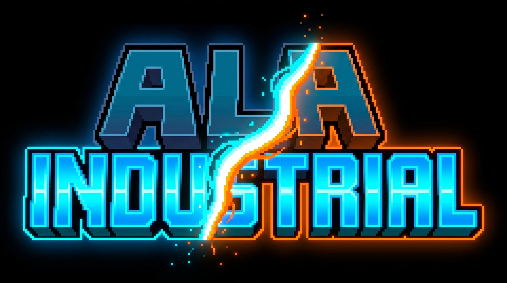

<p align="center">
  
</p>

<h1 align="center">AlaIndustrial</h1>

An IndustrialCraft-inspired tech mod for **Minecraft (Java Edition)** on **Fabric**. It adds an
**EU** energy system with voltage tiers (LV/MV/HV), generators, processing machines, storage, and
energy/fluid transfer.

> The repository is historically named **AlaSolar** (a leftover from an earlier solar-focused
> concept), while the mod id is `alaindustrial`. The solar panel now ships as one of the mod's
> generators.

## Status

The code lives in this repository and builds today: a Fabric prototype for Minecraft 26.2 (Java 25,
Loom). The first public milestone is **0.1.0**, targeted after Phase 1 in
[docs/ROADMAP.md](docs/ROADMAP.md).

The current MVP ships a working LV vertical slice: the EU core, generators, copper cable, an Energy
Storage block, four processing machines, evolution chips, ore dusts, advancements, a recipe viewer
for standard crafting recipes (REI integration), a network analyzer, localization, and the mod icon.

Not yet promised as finished features: MV/HV/EV content, nuclear power, fluid pipes, the oil chain,
rubber, machine upgrades, and dedicated machine-recipe categories. See
[docs/ROADMAP.md](docs/ROADMAP.md) for the delivery plan.

## Build

Full build, run, and toolchain details are in **[docs/BUILD.md](docs/BUILD.md)**. In short:

```bash
export JAVA_HOME=/opt/homebrew/opt/openjdk@25
./gradlew build                  # build the mod
./gradlew runClient              # launch the dev client
./gradlew runGameTest            # in-world GameTests (headless)
```

## Commands

The mod adds an in-game `/ala` command (Brigadier). All subcommands are permission level 0, so
**any player can use them** to check which build of the mod is running on a server:

- **`/ala version`** — a single line with the mod version, git hash, and build time
  (`AlaIndustrial <version> · build <git> · <built>`).
- **`/ala status`** — the version line plus a summary: the number of registered blocks / items /
  recipes in the `alaindustrial` namespace, the energy-network model (cached union-find graph), and
  key `Config` values (`machineEuPerTick`, `networksPerTick`).
- **`/ala net`** — per-dimension energy-network telemetry: the number of networks (active/sleeping),
  cables, plus EU moved in the last tick and in total (from `NetworkManager.stats`).

## Feature categories

Energy: generators, storage, energy transfer. Processing: machines. Logistics and world
automation are planned. See the roadmap for the delivery order.

## Documentation

- [docs/BUILD.md](docs/BUILD.md) — build, run, and toolchain.
- [docs/ROADMAP.md](docs/ROADMAP.md) — delivery plan by phase and release gates.
- [CHANGELOG.md](CHANGELOG.md) — version history (Keep a Changelog + SemVer).
- [CONTRIBUTING.md](CONTRIBUTING.md) — how to contribute.
- [LICENSE](LICENSE) — license terms.
